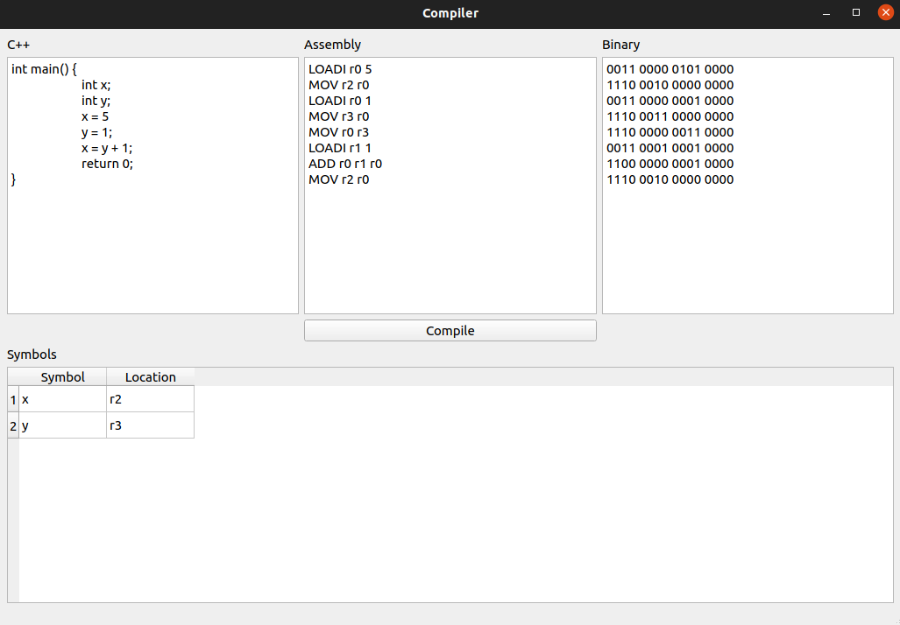

# Tarea 2 - Compiladores

## Integrantes

- Erik Kühlmann Salazar - B84175
- Adrián Sibaja Retana - B87561
- Esteban Marín Masís - B84594

## Instrucciones de ejecución

Abrir usando **Qt Creator** y ejecute el proyecto.

## Capturas de pantalla

